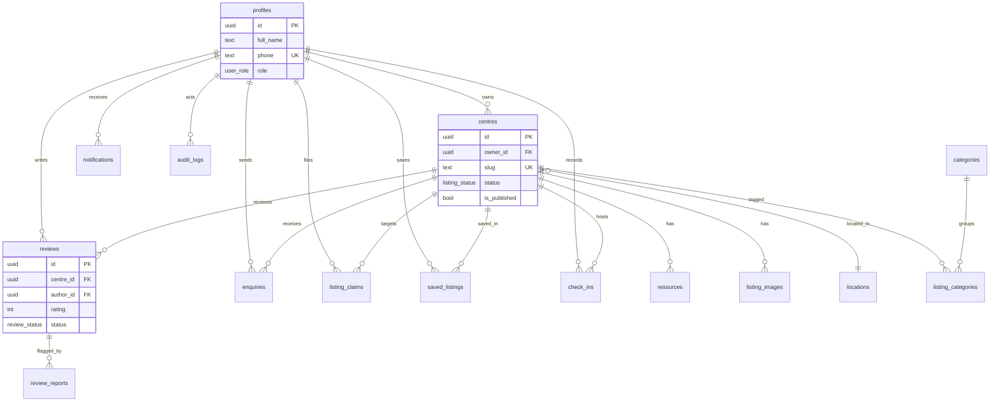

# docs/DATABASE_SCHEMA.md — schema, ERD & Supabase verification

> Satisfies the mandate's "Supabase verification guide". For each form: the exact
> table/columns, whether it inserts or updates, **copy-paste SQL for the Supabase
> SQL Editor**, the data-flow line, and the admin route to manage it without SQL.
>
> Migrations (dependency order): `0001_foundation` → `0002_centres` →
> `0003_directory` → `0004_occupancy` → `0005_storage` → `0006_claims_fn` → `0007_onboarding` → `0008_bookings`. **0003 and 0004 are PROPOSED — approve
> before applying.**

---

## 1. ERD (core directory)



*(Secondary tables — `featured_listings`, `onboarding_progress`, `email_logs`,
`review_reports` — relate as shown / by FK named in the migrations.)*

---

## 2. Table-by-table (what each stores)

| Table | Purpose | Key columns | Constraints / indexes | RLS summary |
|---|---|---|---|---|
| `profiles` | User + role | `id`, `role`, `phone` UK | role enum default student | self read/update; no role self-escalation; admin read all |
| `centres` | Listings | `slug` UK, `status`, `is_published`, `owner_id` | feed/geo/trgm indexes; publish trigger | public reads approved; owner/admin write |
| `resources` | Seats/rooms + pricing | `pricing jsonb`, `tier` | active index | read with centre; owner/admin write |
| `categories` / `locations` | SEO taxonomy | `slug` UK | seeded | public read; admin write |
| `listing_categories` | Centre↔category | PK (centre_id, category_id) | — | read all; owner/admin write |
| `listing_images` | Storage refs | `storage_path`, `is_cover` | one-cover unique partial | read published; owner/admin write |
| `enquiries` | Contact msgs | `status`, `sender_id` nullable | dedupe index | sender/owner/admin read; anyone insert |
| `reviews` | Ratings | `rating` 1–5, `status`, UK(centre,author) | self-review block trigger | published public; author insert; admin moderate |
| `review_reports` | Flags | `resolved` | open-index | anyone insert; admin read/resolve |
| `listing_claims` | Ownership claims | `status`, UK(centre,claimant) | open-index | claimant/admin read; claimant insert; admin update |
| `saved_listings` | Bookmarks | PK(user,centre) | — | strictly self |
| `featured_listings` | Promotions | `ends_at` | active index | public read; admin write |
| `notifications` | In-app alerts | `read_at` | unread index | self only |
| `audit_logs` | Admin trail | `action`, `entity_*` | entity/actor index | admin read; writes via `log_audit()` |
| `onboarding_progress` | Wizard state | `step`, `completed` | — | self |
| `email_logs` | Delivery log | `status`, `provider_id` | status index | admin read |
| `check_ins` | Presence | `checked_out_at` nullable | open/user index | self; owner reads own centre |
| `centre_live_occupancy` (view) | Live seats free | derived | security_invoker | inherits underlying RLS |

---

## 3. Per-form verification (copy-paste into Supabase SQL Editor)

> Replace literals as noted. All queries are **read-only** and safe.

### Form 1 — Create listing → `centres`
**Data flow:** Create Listing form → `centres` table → `name, area, space_type, lat, lng, emoji, owner_id, slug, status`.
Creates **one new row** (`status='draft'`).
```sql
select id, name, slug, area, space_type, status, is_published, owner_id, created_at
from centres
order by created_at desc
limit 5;
```
Manage without SQL: **/admin/centres** (approvals) · owner console.

### Form 2 — Moderate listing → `centres` (UPDATE) + `audit_logs`
**Data flow:** Approve/Reject → `centres.status` (+ `reviewed_by`, `reviewed_at`, `rejection_reason`) → trigger sets `is_published`.
```sql
-- the moderated listing
select name, status, is_published, rejection_reason, reviewed_by, reviewed_at
from centres where slug = 'REPLACE-slug';

-- the audit trail it wrote
select action, entity_id, actor_id, created_at
from audit_logs where entity_type = 'centre'
order by created_at desc limit 10;
```
Manage: **/admin/centres**, **/admin/audit**.

### Form 5 — Enquiry → `enquiries` (+ `email_logs`)
**Data flow:** Contact form → `enquiries` row (`new`) → owner email logged in `email_logs`.
```sql
select e.name, e.email, e.message, e.status, e.created_at, c.name as centre
from enquiries e join centres c on c.id = e.centre_id
order by e.created_at desc limit 10;

select to_email, template, status, created_at
from email_logs order by created_at desc limit 10;
```
Manage: owner dashboard → Enquiries.

### Form 6 — Review → `reviews`
```sql
select r.rating, r.body, r.status, r.is_verified, p.full_name, c.name as centre
from reviews r
join profiles p on p.id = r.author_id
join centres c on c.id = r.centre_id
order by r.created_at desc limit 10;
```
Negative check (owner cannot review own centre): attempting the insert raises `OWNER_CANNOT_REVIEW`.
Manage: **/admin/reviews**.

### Form 7 — Report review → `review_reports`
```sql
select rr.reason, rr.resolved, rr.created_at, r.body
from review_reports rr join reviews r on r.id = rr.review_id
where rr.resolved = false order by rr.created_at desc;
```
Manage: **/admin/reviews**.

### Form 8 — Claim listing → `listing_claims`
```sql
select lc.status, lc.evidence, lc.created_at, c.name as centre, p.full_name as claimant
from listing_claims lc
join centres c on c.id = lc.centre_id
join profiles p on p.id = lc.claimant_id
order by lc.created_at desc limit 10;
```
```
Manage: **/admin/claims** (approve reassigns ownership atomically via `approve_claim`).

### Form 8b — Approve claim → `listing_claims` + `centres.owner_id` (atomic)
```sql
-- after approving, confirm ownership transferred and claim closed
select lc.status, lc.reviewed_by, c.name, c.owner_id
from listing_claims lc join centres c on c.id = lc.centre_id
where lc.id = 'REPLACE-claim-uuid';

-- audit entry written by approve_claim()
select action, entity_id, metadata, created_at
from audit_logs where action = 'claim.approve' order by created_at desc limit 5;
```


### Form 9 — Save listing → `saved_listings`
```sql
select s.created_at, c.name from saved_listings s
join centres c on c.id = s.centre_id
where s.user_id = 'REPLACE-user-uuid';
```

### Form 10 — Check-in → `check_ins` (+ occupancy view)
```sql
-- raw check-ins today
select centre_id, user_id, checked_in_at, checked_out_at
from check_ins where checked_in_at::date = current_date order by checked_in_at desc;

-- derived live occupancy
select centre_id, capacity, inside_now, seats_free, status
from centre_live_occupancy order by seats_free asc limit 10;
```

### Form 11 — Image upload → Storage `listing-images` + `listing_images`
```sql
select centre_id, storage_path, is_cover, sort_order, created_at
from listing_images order by created_at desc limit 10;
```
Verify the file itself in **Storage → listing-images** bucket.

### Form 13 — Auth → `profiles` (via trigger)
```sql
select id, full_name, phone, role, created_at
from profiles order by created_at desc limit 10;
```

---

## 4. Positive / negative test checklist (per mandate)

**Positive** (each built form): submit valid data → row appears in the table above
with every field in the right column → related rows/files present → data persists
after refresh and logout/login.

**Negative** (must NOT store, and must show a clear error):
- missing required field / invalid email / rating out of 1–5,
- duplicate submit / double-click (unique constraints + disabled-pending),
- manipulated `centre_id`/`slug`/`id` → RLS blocks cross-user read/write,
- unauthorised role (student hitting an admin action) → `FORBIDDEN`,
- owner reviewing own centre → `OWNER_CANNOT_REVIEW`,
- guest reaching `/admin` → redirected,
- storage/email/webhook failure → action still returns a typed error, no partial row.

Automated coverage lives in `tests/e2e/*.spec.ts` (positive + negative).

---

## 5. Change log
- 2026-07 — Schema APPROVED (0001–0004). Review fix: occupancy view uses definer semantics so public occupancy aggregates correctly without exposing check_in rows.
